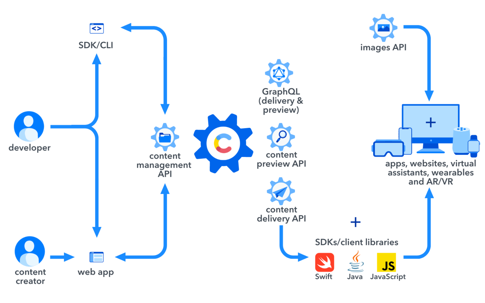
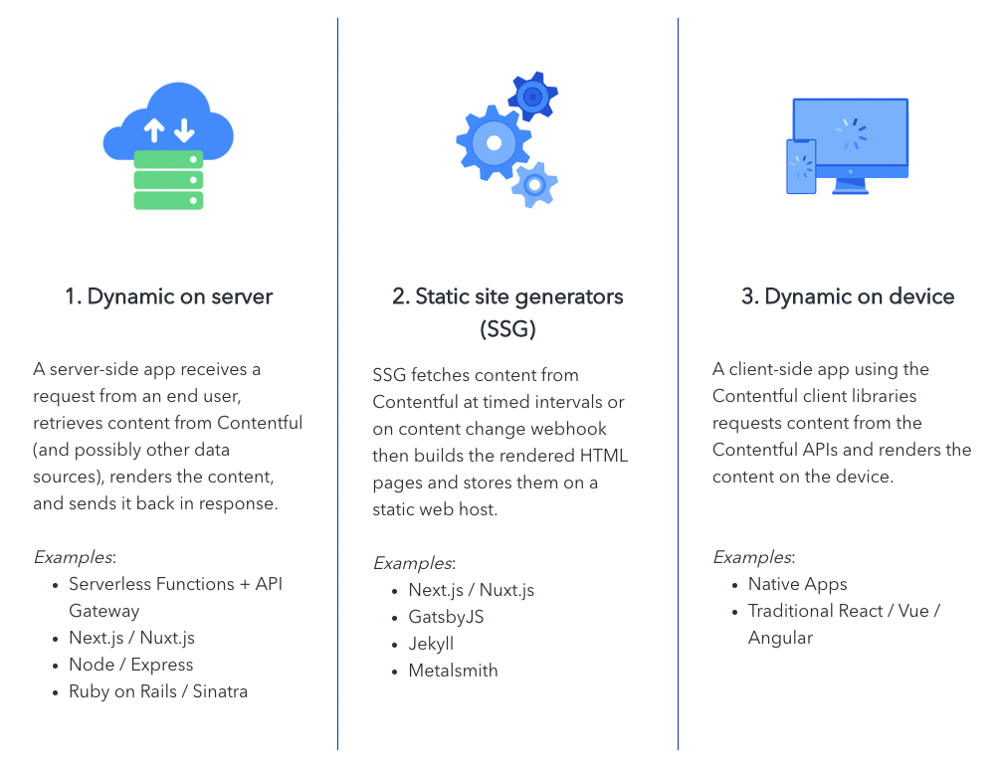

# APIs and Delivery Architecture

## Architecture

- Left side: read and write API
  - Contentful Content Management API (CMA)
- Right side: read-only APIs
  - Contentful Content Preview API (CPA)
  - Contentful Content Delivery API (CDA)
  - **(Or read-only GraphQL API as an alternative for both the CPA and CDA)**
  - Contentful GraphQL API
  - Contentful Images API

Caching:

- CMA and CPA are *not* cached to make sure you're working with the most up-to-date, latest content when writing and previewing content
- CDA and images API are cached via CDN (Fastly for JSON and CLoudFront for media and binary) for performance when delivering content

Rate limit defaults:

- CMA - 10 requests/sec
- CDA - 78 requests/sec

## Content delivery methods

Dynamic on server:

- Server makes API calls to Contentful
- Content from API calls is combined and then rendered (ex - HTML page)

Static site generators:

- SSG retrieves content from Contentful and renders an HTML page server-side (triggered either by specific changes in Contentful or timed intervals)
- SSG ships fully rendered page to CDN
- Users access content from cache of CDN

Dynamic on device:

- Device/app directly makes Contentful API calls
- Device/app combines the result with API calls to other services (templates, etc.)

Usually, these are combined in a hybrid approach!
