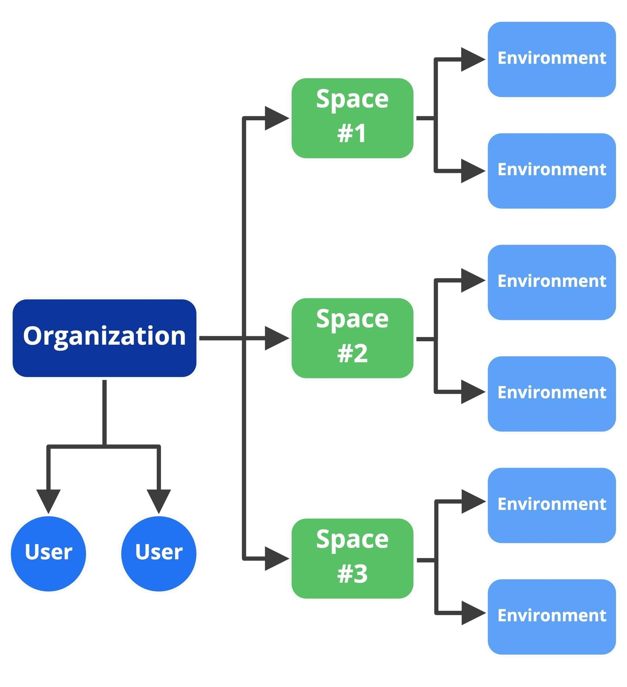

# Intro to Contentful for Developers

## Domain model

- Space - individual repository of content and related settings
- Environments - entities within a space that allow you to have multiple versions of space-specific data and config
  - Allows you to make changes to a version in isolation
  - Every space has a master environment by default

## Get JSON from REST API endpoint (using the CDA)

`cdn.contentful.com/spaces/{space_id}/entries?access_token={access_token}`

[Video on where to get space id and token](https://contentful.wistia.com/medias/qdp5l5bz9x)

Sys - every resource returned by the CDA has a `sys` object with system-managed metadata:

- Content type ID (unique to the content type)
- Entry ID (unique to that specific entry)
- createdAt and lastUpdatedAt dates

[Example of request for single entry](https://www.contentful.com/developers/docs/references/content-delivery-api/#/reference/entries/entry/get-a-single-entry/console/js)
