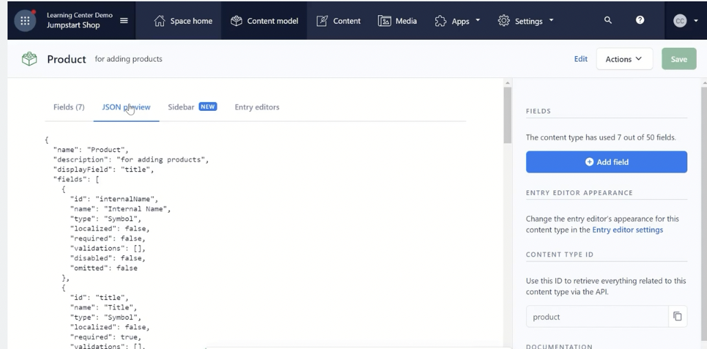
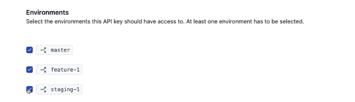
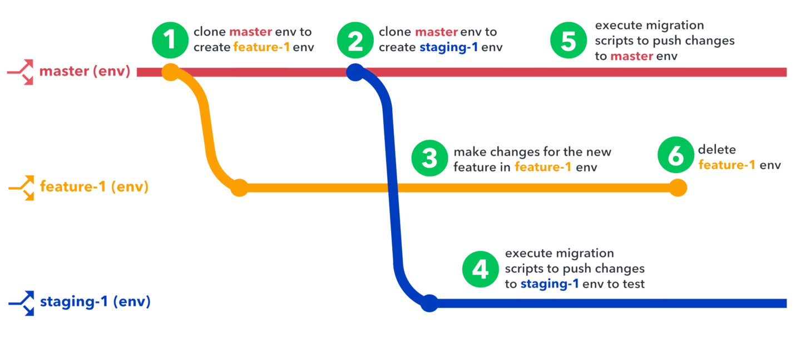

# Managing Content with Code

The content model is represented in a JSON that can be viewed alongside the web app version using the JSON preview tab:



This lets you learn about things like if a field references multiple values, its type will be `Array` (such as a one-to-many reference or a media field that allows multiple pieces of media), or the fact that short text comes through as type `Symbol`.

Every time you change something in the field settings, it immediately reflects in the JSON as well.

## CLI

[Installing the CLI](https://www.contentful.com/developers/docs/tutorials/cli/installation/)

To log in, you need to use a Content Management API (CMA) token. In the terminal, type `contentful login`. This will open a browser window to log into the web app, authorize, and then copy and paste the unique CMA token.

To confirm successful login and correct space, run: `contentful space list`. This will show the space name and id.

## Migration scripts

[Contentful migration tool documentation (Github readme)](https://github.com/contentful/contentful-migration/)

Most used functions:

- createContentType → Creates a content type with provided id
- editContentType → Edits an existing content type of provided id
- deleteContentType → Deletes the content type with the provided id
- createField → Creates a field with provided id
- editField → Edits the field of provided id
- deleteField → Shorthand method to omit a field, publish its content type, and then delete the field

### Example: Create new content type

[Create new content type](https://github.com/contentful/ls-jumpstart-shop/blob/main/migrations/01-create-productSection-contentType.js)

```js
module.exports = function(migration) {
    //First, create the content type overarching information
    const productSection = migration
        .createContentType("productSection")
        .name("Product Section")
        //Display field is the one that shows on the web app
        .displayField("title");

    //Then, create fields one by one
    const internalName = productSection
        .createField("internalName")
        //Name is the title of the field within Contentful
        .name("Internal Name")
        .type("Symbol");

    const title = productSection
        .createField("title")
        .name("Title")
        .type("Symbol")
        //Add settings like required as necessary
        .required(true);

    const products = productSection
        //This is a reference field that links to any entry of "product" content type
        .createField("products")
        .name("Products")
        //One-to-many reference fields are type Array. One-to-one reference fields are type Link. 
        .type("Array")
        //Items define allowed contents within the field
        .items({
            type: "Link",
            linkType: "Entry",
            //This validation is where it's enforced that this can only contain entries of content type "product"
            validations: [{ linkContentType: ["product"] }],
        });
};
```

To run with the migration CLI: `contentful space migratio- --space-id SPACE_ID_HERE RELATIVE_PATH_TO_SCRIPT_FILE`
(e.g. `contentful space migratio- --space-id 12sd1f6ae165e migrations/01-create-productSection-contentType.js`)

By default, the CLI will double check the details and ask you to confirm. To avoid this (like when running the script automatically), add a `-y` to the end of the CLI command above.

### Example: Edit content type

[Edit content type](https://github.com/contentful/ls-jumpstart-shop/blob/main/migrations/02-edit-product-contentType.js)

```js
module.exports = function (migration) {
    //Goal: change the appearance of the Slug field and add validation to the Description rich text field

    //Create a variable that specifies which product type to edit
    const product = migration.editContentType("product");

    //Changes the slug field from just a short text field to specifically use the built in widget for generating slugs
    product.changeFieldControl("slug", "builtin", "slugEditor");

    //Specify field to edit
    product.editField("description")
        //Previously, this rich text field had no allowed formatting options. Here, this uses .validations to change this.
        .validations ([
            {
                enabledNodeTypes: [
                    "heading-1",
                    "hyperlink",
                    "ordered-list",]
            },
            {
                enabledMarks: ["bold", "italic", "underline"],
            },
        ])

}
```

A full list of validations options is in the [content type validations documentation](https://www.contentful.com/developers/docs/references/content-management-api/#/reference/content-types/content-type).

Run this command in the CLI in the same way as the one above!

## Auto-generating migration scripts

After a content model is built, it can be exported with the [space generation migration command](https://github.com/contentful/contentful-cli/tree/master/docs/space/generate/migration), which auto-generates a migration file for either the whole content model or a specific content type.

`contentful space generate migration <args>`

Args:

- --space-id, -s -> ID of the Space to use
- --environment-id, -e -> ID of the Environment to use
- --content-type-id, -c -> Optional - ID of the Content Type to use. If omitted will generate a migration for the complete content model
- --filename, -f -> Optional - Name of the generated file. If omitted will generate one with the format SPACE_ID-ENV_ID[-CT_ID]-TIMESTAMP

## Environments

When a space is created, it comes with a default master environment (like the main branch in git). You can then spin up sandbox environments from this.

- Master environment -> production
- Sandbox environments -> non-production development and testing

Every time you spin up a sandbox environment, it creates a copy of the current version of the content model and content from the environment it's cloned from. Any further changes are contained to just that sandbox environment. Sandbox environments don't maintain version history (master environment does!).

Content creators can work uninterrupted in the master environment while developers clone off sandbox environments to build and test new features.

Some developers use long-lived environments that mirror their application environments, such as development, QA, staging, and production. Others spin up short-lived environments for every sprint.

To access the different environments with the CLI, you need to allow access via the API key:



## Example of workflow using environments and migration scripts to make a change


